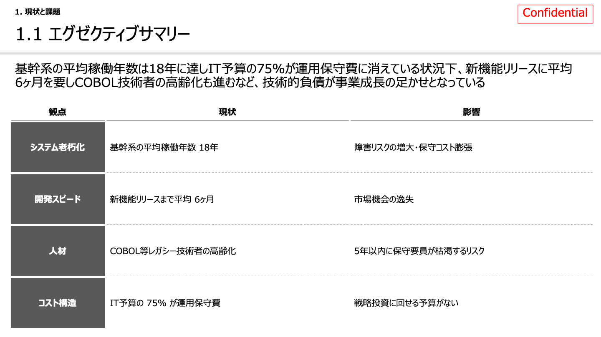
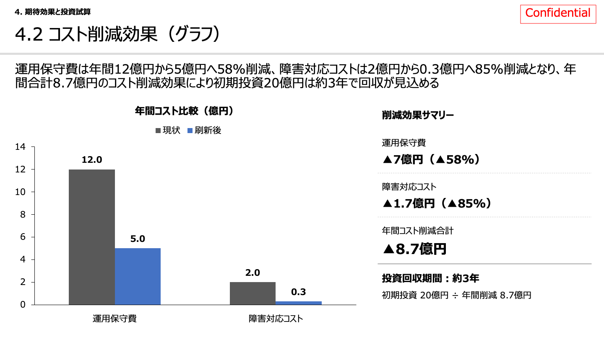

# claude-in-ppt-consulting

**Consulting-style instructions & skills for Claude in PPT**  
コンサルライクな資料を Claude in PPT で作成するための Instructions とスキル集です。

> ⚠️ This is an unofficial prompt set, not affiliated with or endorsed by Anthropic.

---

## 概要 / Overview

MBBやBIG4等の外資系コンサルライクなスライドを、Claude in PPTが自動で作成してくれます。既存のスライドに対して変換することも可能です。
以下の方針で資料作成を行う Instructions とスキルを提供します。

- シンプル・プロフェッショナルなデザイン（黒・白・グレー基調）
- 論理的なスライド構成（章番号・目次・メッセージライン）
- スライドマスタを尊重したフォント・レイアウト管理
- ネイティブオブジェクト優先（アイコン・矢印・表）
- PPT組込みの表を使わず、四角形や線、破線によるオブジェクトで表現する
- メッセージラインは100文字程度で、スライドのボディを説明するように

完成イメージは以下のようになります。  
※スライド本体には全く手を加えていません

　　


## ファイル構成 / Files

```
claude-in-ppt-consulting/
├── README.md
├── LICENSE
├── instructions.md         # Claude in PPT の Instructions に貼り付けるプロンプト
├── template.potx           # スライドマスタ入りテンプレート（任意）
└── skills/
    ├── update-toc/
    │   └── SKILL.md        # /update-toc : 目次スライドを自動生成・更新
    └── apply-layout/
        └── SKILL.md        # /apply-layout : 選択スライドをマスタに従いリデザイン
```

## 動作環境 / Requirements

| | 推奨 | 最低限 |
|---|---|---|
| プラン | Claude Max（Opus） | Claude Pro |

> スライド生成・スキル実行はトークン消費が大きいため、Claude Pro 以上を推奨します。Max プランの Opus モデルが最も安定します。

## 使い方 / Usage

### 1. テンプレートを開く

`template.potx` をダブルクリックして新規 PowerPoint ファイルを作成します。  
既存のスライドマスタを使う場合はこの手順をスキップしてください。

### 2. Instructions を設定する

1. Claude in PPT を開く
2. 設定アイコン → Instructions を開く
3. `instructions.md` の内容をすべてコピーして貼り付ける

### 3. スキルを追加する（任意）

1. [claude.ai](https://claude.ai) にログインする
2. 左サイドバーの「カスタマイズ → スキル → ＋」を開く
3. 追加したいスキルの `SKILL.md` の内容をコピーして貼り付け、保存する
4. Claude in PPT を再起動すると `/update-toc` `/apply-layout` のコマンドで呼び出せます

> 💡 `/skill-creator` を使うとスキルの改変・カスタマイズができます。

| コマンド | 内容 |
|---|---|
| `/update-toc` | 目次スライドを自動生成・更新する |
| `/apply-layout` | 選択中のスライドをスライドマスタに従いリデザインする |

### 4. スライドを作成する

Instructions を設定した状態で、Claude in PPT に自然言語で指示するだけです。

```
例：
「競合分析のスライドを作って。3社比較で、評価軸は価格・品質・サポートの3つ。」
```

## 既知の制限・WIP

- [ ] 英語版 Instructions の提供
- [ ] スキルの追加（図解自動生成など）

Instructions・スキルともに改善中です。

## ライセンス / License

MIT License © 2026 iCON Inc. (株式会社iCON)

本リポジトリのプロンプト・スキルファイルに適用されます。  
Claude in PPT および Claude は Anthropic の製品です。本リポジトリは Anthropic とは無関係です。
